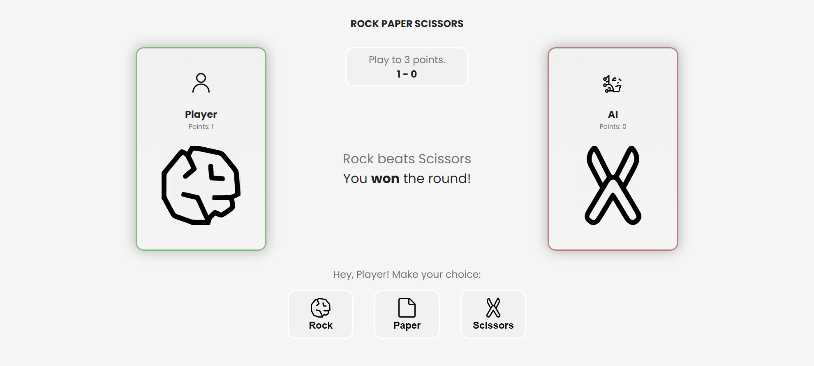

# Rock-Paper-Scissors (Odin Project)

[Live link is here.](https://x6nenko.github.io/Odin-Rock-Paper-Scissors/)

## Project tasks.
- [x] The game is going to be played against the computer. Create a function called getComputerChoice that will randomly return either ‘Rock’, ‘Paper’ or ‘Scissors’.
- [x] Write a function that plays a single round of Rock Paper Scissors. The function should take two parameters - the playerSelection and computerSelection - and then return a string that declares the winner of the round.
- [x] Create UI. The player should be able to play the game by clicking on buttons.
    - [x] Create three buttons, one for each selection. Add an event listener to the buttons that call your playRound function with the correct playerSelection every time a button is clicked.
    - [x] Add a div for displaying results.
    - [x] Display the running score, and announce a winner of the game once one player reaches X points.

## Extra features. They are not required by a project. That's my list of optional ideas and tasks to make it better.

### Extra features that were implemented:
- [x] Better UI. Made it simple and clear. Added subtle indicators, like the border color of cards, that are based on the results.
- [x] Two Arrays of AI quotes: when the match has ended, AI will use one of those replicas based on the results.

### Extra features and tasks to implement:
- [ ] Refactor the code. Make it more clean. DRY.
- [ ] Add a level system.
- [ ] Add the possibility of choosing the number of rounds to be played.
- [ ] Add responsibility for mobile screens.

## What I've learned.
Importance of: 
- writing clean code; 
- refactoring the code; 
- well-structured code;
- its importance during the whole process.

When the project becomes more complex, it is so easy to work with if everything is well structured.

